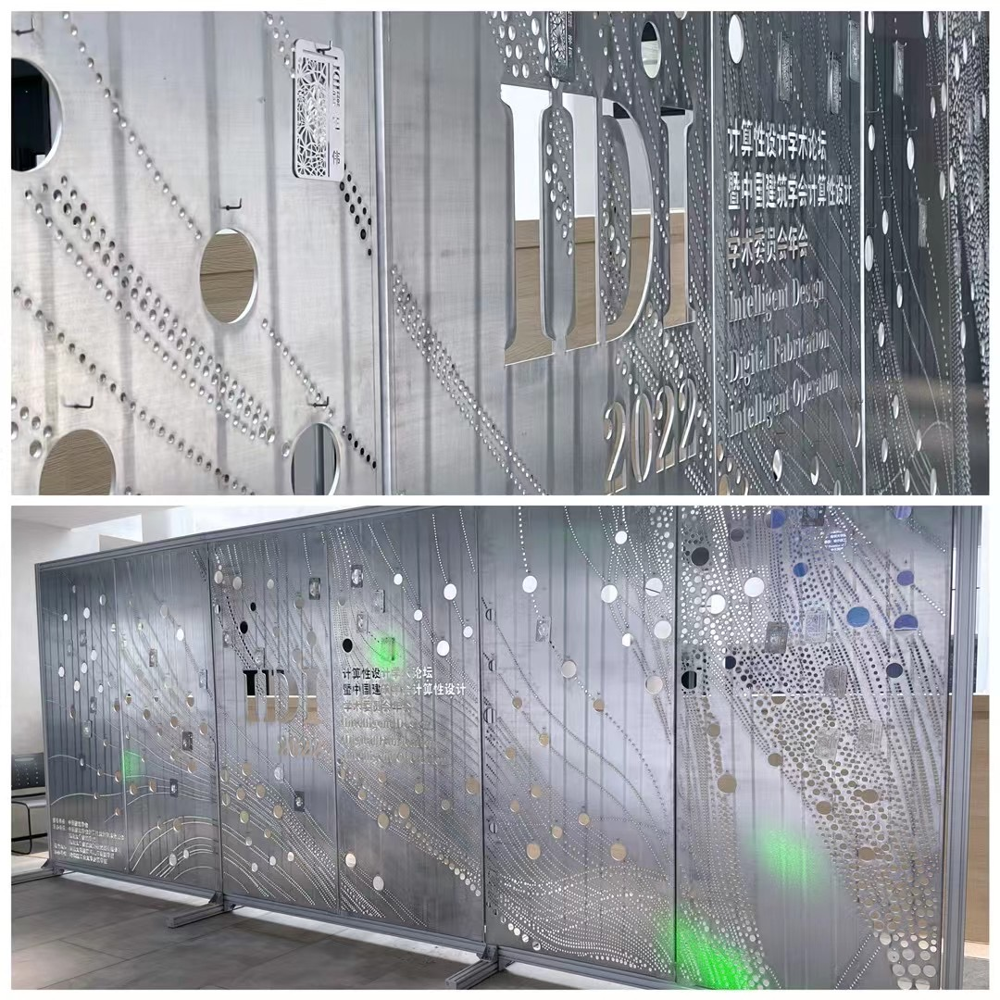
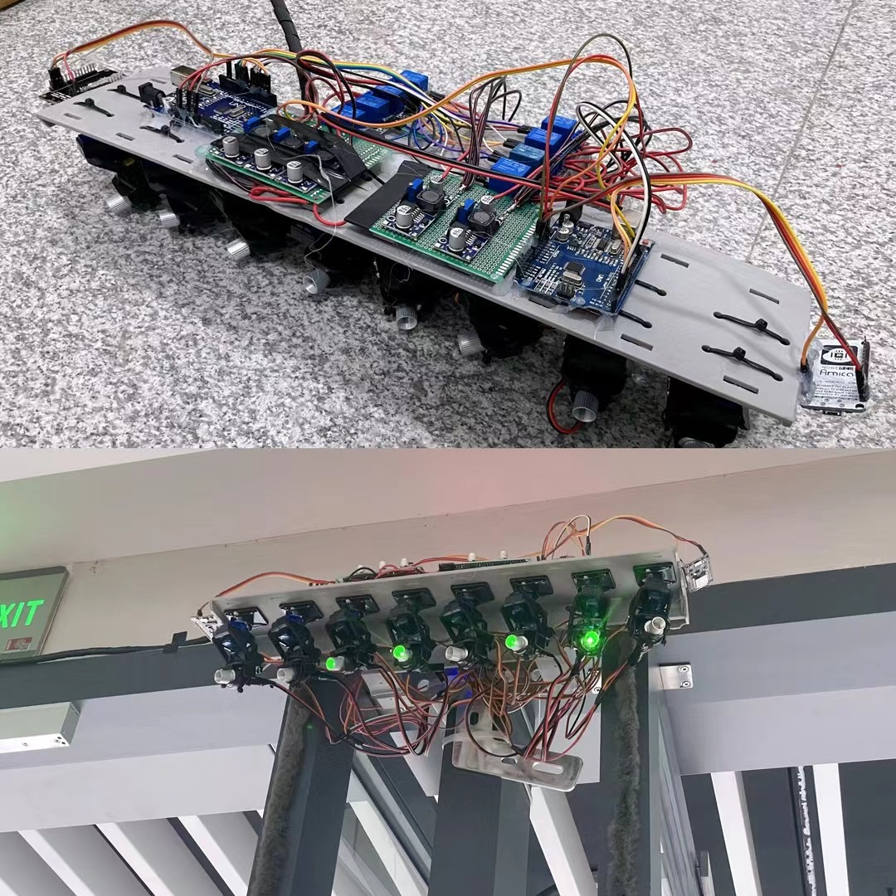

# Interactive laser installation

Control laser head devices to interact with people front in a sign-in board by pointing at target and show animation by moving heads' direction，using processing serial port communication

## Introduction

This program is based on an academic conference held by SouthEast University: 2022计算性学术论坛暨中国建筑学会计算性学术委员会

We wanted to let candidates pick their own badge from a sign-in board rather than get them from a desk that all badges are stacked together, the moment candidates pick their badges also means they complete the sign-in process.

As more and more candidates signed in, the sign-in board will appear a different out-looking which is more transparent and also brighter as more light pass through the appeared hole.

However, here we inevitably must fase a problem that candidates are difficult to find their own badges from a big sign-in board while all other badges are also on the board, so we decided to develop a interactive installation which help candidates to find their badges.

In spear time, this illstration will move regularly and rythumly, make sign-in board looks like it has lots of light pots dancing on it.

## Interative sign in board

The texture on the board also generated by program, using tools in self-developed grasshopper plug-in

## Getting badges with the help of laser head

## Laser head

